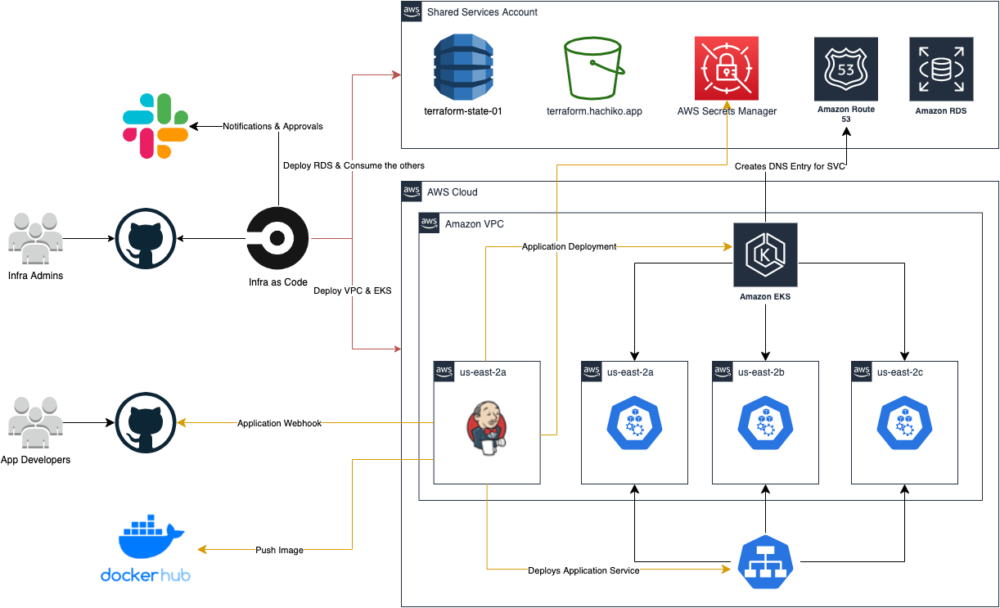

# Infrastructure as code deployment using Terraform, CircleCI and AWS

Following the instructions described in this project you will be able to deploy an AWS EKS cluster with some add-ons.

# Architecture

## Products Required

- AWS Account with Access and Secret keys
- CircleCI Account
- GitHub Account
- DockerHub Account
- Slack Account

# Requirements in AWS before launch the deployment

- AWS S3 Bucket
- Custom domain registered in Route53 with its hosted zone
- SSL Certificate provisioned in AWS Certificate Manager for your custom domain
- DynamoDB table
- Secrets registered on AWS Secrets Manager

## AWS Account with Access and Secret keys

It is required to be proficient with AWS. You must create a IAM User with the needed permissions, for this lab you can provision a user with AdministratorAccess Policy (not for production).

### AWS Secrets Manager configuration

We need to create the following secrets values:

- aws secretsmanager create-secret --name 'DB_ENDPOINT' --secret-string 'terraform-eks-01.ckz23kltqu6m.us-east-2.rds.amazonaws.com' --tags 'Key=jenkins:credentials:type,Value=string' --description 'Database Endpoint'
- aws secretsmanager create-secret --name 'AWS_ACCOUNT_ID' --secret-string '342288875929' --tags 'Key=jenkins:credentials:type,Value=string' --description 'AWS Account Id'
- aws secretsmanager create-secret --name 'DB_NAME' --secret-string 'timeoffdb' --tags 'Key=jenkins:credentials:type,Value=string' --description 'Database Name'
- aws secretsmanager create-secret --name 'DB_USERNAME' --secret-string 'timeoffuser' --tags 'Key=jenkins:credentials:type,Value=string' --description 'Database Username'
- aws secretsmanager create-secret --name 'DB_PASSWD' --secret-string 'Cool7*Quickly*Learning' --tags 'Key=jenkins:credentials:type,Value=string' --description 'Database Password'
- aws secretsmanager create-secret --name 'DB_DIALECT' --secret-string 'mysql' --tags 'Key=jenkins:credentials:type,Value=string' --description 'Database Dialect'

We need the tags `Key=jenkins:credentials:type,Value=string` because in the application deployment, we are going to use that tag to recover the secrets during the pipeline.

## AWS configuration

It's good practice to manage the Terraform State and Lock on a centralized location. To accomplish this requirement we use DynamoDB and S3 Bucket.

- Create a S3 Bucket with versioning active
- Create a DynamoDB table with LockID as primary key

Adjust values on the following keys in state_config.tf file: 

| Line | Key Name       | Value                 | Description                                            |
| ---- | -------------- | --------------------- | ------------------------------------------------------ |
| 3    | bucket         | terraform.hachiko.app | S3 Bucket name used to save the Terraform State        |
| 5    | region         | us-east-1             | Region where you are going to deploy the AWS resources |
| 6    | dynamodb_table | terraform-state-01    | DynamoDB table used to save the Terraform Lock         |

## Terraform Configuration

Adjust the values in the file state_config.tf accordingly to the table above.

- bucket
- region
- dynamodb_table

You are able to personalize some values in the variables.tf file.

## CircleCI Configuration

The CircleCI configuration is simple, just hook your GitHub account with CircleCI. Once you have your CircleCI linked with GitHub, setup the project in the `Add Projects` section. Then press the button `Set Up Project` in from of the repository, and press the `Add Config` button, this is just a starting point, it creates a new branch in your GitHub repository called `circleci-project-setup`. We don't need this branch, so you can delete it.

This project comes with a CircleCI configuration file located in `.circleci/config.yml`, so the next time you make a commit in your master branch, CircleCI will build the Terraform according to the instructions in the `config.yml` file.

Once the project is configured, go to `Project Settings`, `Environment Variables` and add the following variables:

- AWS_ACCESS_KEY_ID
- AWS_ACCOUNT_ID
- AWS_DEFAULT_REGION
- AWS_SECRET_ACCESS_KEY
- SLACK_WEBHOOK

If you don't want to implement Slack notifications, don't create the variable and remove every Slack entry from the file .circleci/config.yml.

## Application in CI/CD for testing this infrastructure

In the following link we implement a CI/CD for an application that use this infrastructure. 

- [Timeoff Management Application](https://github.com/williammunozr/timeoff-management-application)

## Resources

- [External DNS](https://github.com/kubernetes-sigs/external-dns)
- [CircleCI Slack Orb](https://circleci.com/orbs/registry/orb/circleci/slack)